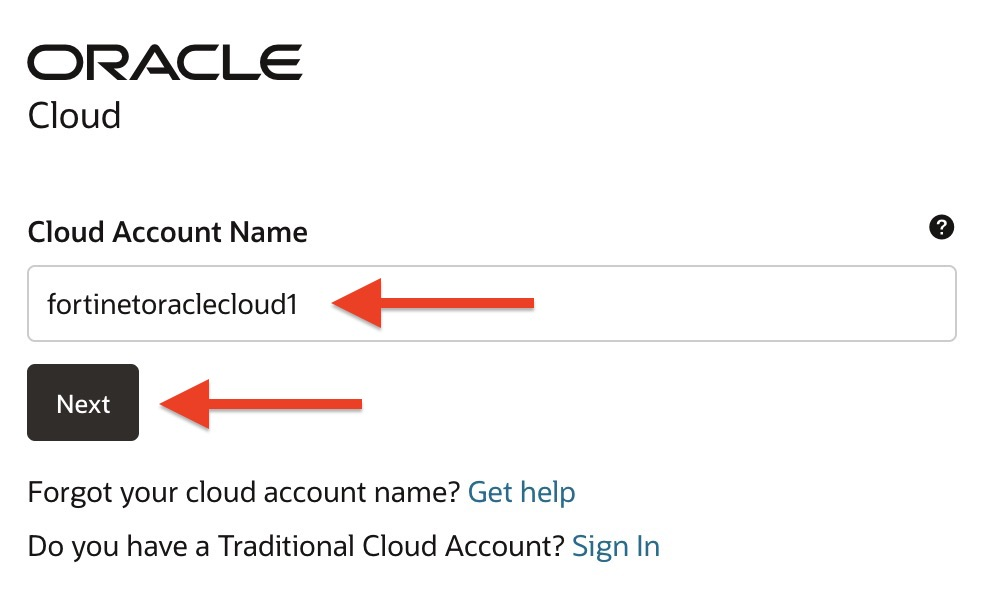
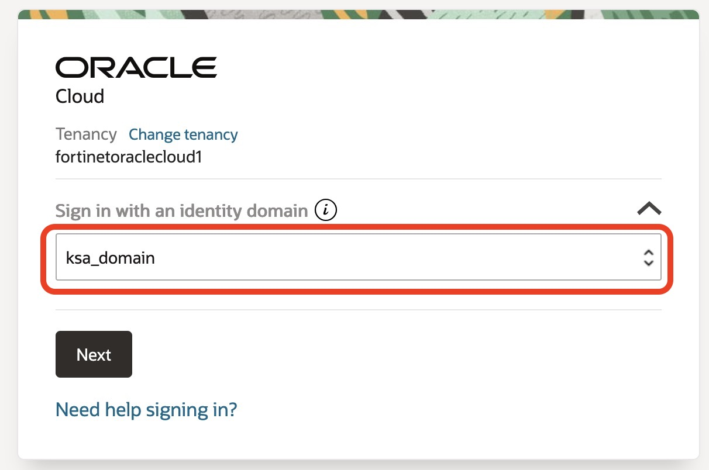
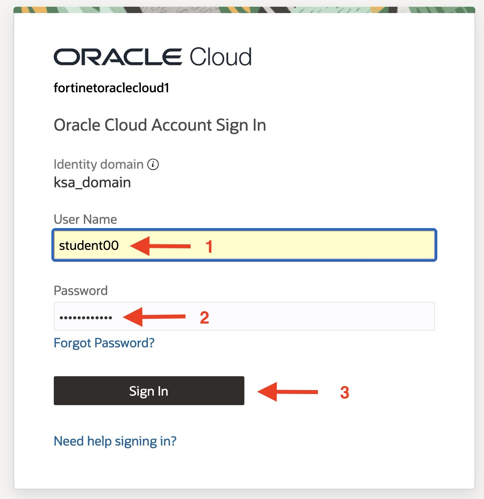
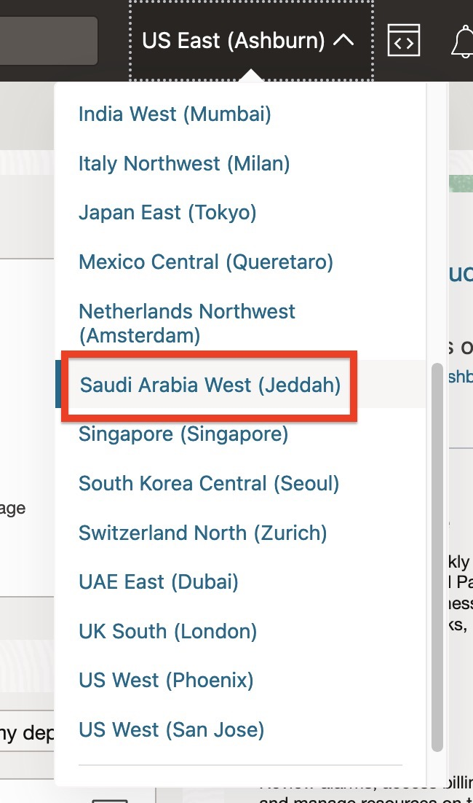

````markdown
# Section 1: Log In to OCI and Prepare for Deployment

In this section, you will sign in to the Oracle Cloud Infrastructure (OCI) Console using your assigned credentials, select the correct identity domain, and change the OCI region to the region used for this lab.

---

## Step 1.1: Sign In to the OCI Console

Open the OCI Console using the link below. Your username and password will be provided during the lab session.

[Access the OCI Console](https://cloud.oracle.com)

Enter the following cloud account name, and then click **Next**:

```text
fortinetoraclecloud1
```



From the identity domain drop-down list, select **ksa_domain**, and then click **Next**.



Enter your assigned username and password, and then click **Sign In**.



---

## Step 1.2: Select the OCI Region

Open the region selector in the upper-right corner of the OCI Console, and then select **Saudi Arabia West (Jeddah)**.



---

## Checkpoint

Before continuing, confirm that:

- You are signed in to the OCI Console.
- The identity domain is set to **ksa_domain**.
- The selected region is **Saudi Arabia West (Jeddah)**.